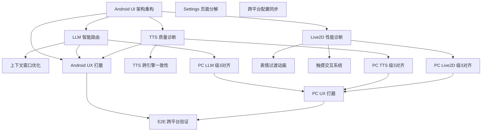

# Live2D-Ai — Phase 0 架构评估与级3推进方案

> **Architect**: SPOQ software-architect
> **日期**: 2026-08-07
> **当前架构版本**: V1（2026-08-05 双端验收 PASS）
> **目标**: 深度重构 + 三层推进到级3

---

## 一、项目现状评估

### 1.1 总体评分

| 维度 | 评分 | 说明 |
|------|------|------|
| Live2D 渲染 | ★★★★☆ | Purism Core (MIT) + 完整动画管线，8表情 + LipSync，成熟度高 |
| AI 对话 | ★★★☆☆ | 多 Provider 已就位，但缺少智能路由/健康监控/退避策略 |
| TTS 语音 | ★★★☆☆ | 降级链就位(4引擎)，但缺少质量诊断/延迟度量/跨引擎一致性 |
| UI/UX | ★★☆☆☆ | 功能可用但架构混乱，单文件巨石，无 ViewModel 分层 |
| 跨平台一致性 | ★★★☆☆ | shared/ 单源真理已确立，但同步靠手动 cp |
| 代码架构 | ★★☆☆☆ | 全部代码在单包内，无分层；PC 端是 thin fork |
| 测试覆盖 | ★★★★☆ | 91 单测全过，但缺少 UI/集成测试 |

### 1.2 技术债清单

| # | 问题 | 严重度 | 位置 |
|---|------|--------|------|
| 1 | **MainActivity 巨石**：500+ 行含 UI + 业务 + 生命周期 + 插件装载 + LLM 调用 | 🔴 P0 | `MainActivity.kt` |
| 2 | **SettingsScreen 巨石**：1100+ 行混杂设置/下载/UI/状态管理 | 🔴 P0 | `SettingsScreen.kt` |
| 3 | **无架构分层**：全部 Kotlin 文件在单包 `com.live2d.ai.android`，无 domain/data/presentation | 🟡 P1 | 全局 |
| 4 | **ChatService 过载**：LLM 调用 + 工具循环 + 插件钩子 + 历史管理在一类 | 🟡 P1 | `ChatService.kt` |
| 5 | **硬编码模型路径**：`Live2DRenderer.loadModel()` 写死路径前缀 | 🟡 P1 | `Live2DRenderer.kt` |
| 6 | **PC 端 thin fork**：仅 conf.yaml 精简 + start.ps1，未做深度集成 | 🟡 P1 | `Live2D-Ai-pc/` |
| 7 | **手动配置同步**：`shared/` → Android assets 需 `cp` 命令 | 🟢 P2 | 构建脚本 |
| 8 | **缺少 UI 状态管理**：Compose `remember/mutableStateOf` 裸用，无 ViewModel | 🟡 P1 | `MainActivity.kt` |
| 9 | **错误处理粗糙**：网络异常在 UI 层展示，无统一 error boundary | 🟢 P2 | `ChatService.kt` |
| 10 | **API Key 硬编码**：`ChatService.kt` 常量 `DEEPSEEK_API_KEY` | 🟢 P2 | 已部分通过 SettingsRepository 解决 |

### 1.3 代码统计

| 端 | 语言 | 主要源文件 | 约估行数 |
|----|------|-----------|---------|
| Android | Kotlin | ~40 核心文件 | ~8,000 |
| Android | C++ (JNI) | native-lib.cpp + purism/ | ~3,000 |
| PC | Python | ~60 文件 (open_llm_vtuber) | ~8,000 |
| 共享 | YAML/JSON | persona.yaml, mcp_tools.json, model_dict.json | ~300 |
| 测试 | Kotlin/Python | ~30 测试文件 | ~3,000 |
| **总计** | | | **~22,000** |

---

## 二、级3定义（ROMA 2026 标准）

> ROMA 2026 级3含义：每一层选**最好的方案 + 一个经过验证的降级方案**，具备可观测性诊断。

### 2.1 三层模型

```
┌──────────────────────────────────────────────────┐
│  Layer 3: Live2D 渲染层                           │
│  级3目标: 最优渲染管线 + 验证过的备选渲染器        │
│  指标: FPS/帧时间/GPU内存/draw calls              │
├──────────────────────────────────────────────────┤
│  Layer 2: TTS 语音合成层                          │
│  级3目标: 最佳音质引擎 + 验证过的离线降级          │
│  指标: 首音延迟/合成耗时/音质评分/降级成功率       │
├──────────────────────────────────────────────────┤
│  Layer 1: AI 对话层                               │
│  级3目标: 最优 LLM + 验证过的免费兜底              │
│  指标: 首token延迟/吞吐/成功率/退避恢复率          │
└──────────────────────────────────────────────────┘
```

### 2.2 各层级3具体定义

#### Layer 1: AI 对话（LLM）— 当前级2 → 目标级3

| 能力 | 级2（当前） | 级3（目标） |
|------|-----------|-----------|
| 主 LLM | DeepSeek V4 Flash (手动切换) | DeepSeek V4 Flash + 自动健康检测 |
| 降级 LLM | GLM-4.7-Flash (免费共享Key) | GLM-4.7-Flash (自动降级 + 个人Key引导) |
| 路由策略 | 无（手动选 Provider） | 智能路由：健康检查 → 延迟排序 → 自动切换 |
| 退避策略 | 无 | 指数退避 + jitter + 429 特殊处理 |
| 上下文管理 | 简单消息对截断(50对) | Token 计数 + 智能摘要 + 滑动窗口 |
| 可观测性 | 无 | 首 token 延迟/成功率/降级次数度量 |

#### Layer 2: TTS 语音合成 — 当前级2 → 目标级3

| 能力 | 级2（当前） | 级3（目标） |
|------|-----------|-----------|
| 主 TTS | Edge TTS（境外 403 被墙） | CosyVoice 云端（国内直连、低延迟） |
| 离线 TTS | sherpa-onnx（级2-B 可用但音质一般） | sherpa-onnx v2 优化模型（音质提升） |
| 降级链 | edge → cosyvoice → sherpa → system | cosyvoice → sherpa → edge → system |
| 中断处理 | stop() 逐引擎调用 | 统一 cancel token + 资源释放 |
| 可观测性 | VoiceTelemetry 基础事件 | 首音延迟/合成耗时/降级原因/音质标记 |

#### Layer 3: Live2D 渲染 — 当前级2 → 目标级3

| 能力 | 级2（当前） | 级3（目标） |
|------|-----------|-----------|
| 渲染核心 | Purism Core + OpenGL ES 2.0 | Purism Core + GLES 3.0 可选优化 |
| 抗锯齿 | MSAA 4x | MSAA 4x + FXAA 后处理可选 |
| 表情切换 | 8 表情瞬间切换 | 8 表情 + 交叉淡入淡出过渡动画 |
| 模型热切换 | switchModel (GL线程回调) | 热切换 + 过渡动画 + 失败回退 |
| 触摸交互 | 无 | 点击/滑动响应 + 物理反馈 |
| 性能诊断 | 无 | FPS/帧时间/GPU 内存度量面板 |
| 降级渲染 | 无 | 简化着色器路径（低端设备自动切换） |

---

## 三、架构分层方案

### 3.1 Android 端 — 目标架构

```
Live2D-Ai-Android/app/src/main/java/com/live2d/ai/android/
├── core/                         # 核心层（不依赖 UI）
│   ├── llm/                      # LLM 抽象
│   │   ├── LLMProvider.kt        #   接口 + 数据模型
│   │   ├── LLMProviderManager.kt #   路由/健康检查 (已存在，需移入)
│   │   ├── DeepSeekProvider.kt
│   │   ├── ZhipuProvider.kt
│   │   └── LLMRouter.kt          #   ★ 级3新增: 智能路由
│   ├── tts/                      # TTS 抽象
│   │   ├── TtsProvider.kt        #   接口 (已存在)
│   │   ├── TtsProviderRegistry.kt#   注册表 (已存在)
│   │   ├── CosyVoiceTtsProvider.kt
│   │   ├── EdgeTtsProvider.kt
│   │   ├── SherpaOnnxTtsProvider.kt
│   │   ├── SystemTtsProvider.kt
│   │   └── TtsDiagnostics.kt     #   ★ 级3新增: 质量诊断
│   ├── asr/
│   ├── live2d/                   # Live2D 渲染核心
│   │   ├── Live2DRenderer.kt     #   主渲染器 (已存在)
│   │   ├── AnimationSystem.kt    #   动画系统 (已存在)
│   │   ├── EmotionController.kt  #   表情控制 (已存在)
│   │   └── RenderDiagnostics.kt  #   ★ 级3新增: 渲染诊断
│   ├── persona/
│   └── plugin/                   # 插件 SDK
│
├── data/                         # 数据层
│   ├── SettingsRepository.kt     #   (已存在)
│   ├── ChatHistoryStore.kt       #   (已存在)
│   ├── ModelRegistry.kt          #   (已存在)
│   └── ConfigSync.kt             #   ★ 新增: 配置自动同步
│
├── domain/                       # 领域层
│   ├── ChatUseCase.kt            #   ★ 重构: 从 ChatService 提取
│   ├── VoiceUseCase.kt           #   ★ 重构: 从 MainActivity 提取
│   └── model/                    #   领域模型
│
├── ui/                           # 表现层
│   ├── main/
│   │   ├── MainViewModel.kt      #   ★ 新增: ViewModel
│   │   ├── MainScreen.kt         #   ★ 重构: 从 MainActivity 提取
│   │   └── ChatBubble.kt         #   (已存在, 移入)
│   ├── settings/
│   │   ├── SettingsViewModel.kt  #   ★ 新增
│   │   ├── SettingsScreen.kt     #   ★ 拆分: 分解巨石
│   │   ├── sections/             #   ★ 各设置板块独立文件
│   │   └── EngineSelectorUi.kt   #   (已存在, 移入)
│   ├── components/               #   共享 UI 组件
│   └── theme/
│
└── MainActivity.kt               # 精简为入口 (~50行)
```

### 3.2 PC 端 — 目标架构

```
Live2D-Ai-pc/
├── open-llm-vtuber/              # 上游（保持最小 diff）
│   └── ...                       #   仅 conf.yaml + persona 加载
├── live2d_ai_pc/                  # ★ 新增: Live2D-Ai 定制层
│   ├── __init__.py
│   ├── llm_router.py             #   LLM 智能路由（与 Android 同构）
│   ├── tts_diagnostics.py        #   TTS 诊断
│   ├── live2d_diagnostics.py     #   渲染诊断
│   ├── config_sync.py            #   配置自动拉取 shared/
│   └── desktop_ux.py             #   桌宠 UX 增强
├── conf.yaml                     # 精简配置
├── start.ps1                     # 一键启动
└── README.md
```

### 3.3 跨平台共享契约

```
shared/
├── persona.yaml                  # 人设（单源真理，已有）
├── mcp_tools.json                # MCP 工具（已有）
├── model_dict.json               # 模型路由表（已有）
├── contracts/                    # ★ 新增: 接口契约
│   ├── emotion_tags.yaml         #   表情标签枚举（两端一致）
│   ├── tts_providers.yaml        #   TTS Provider 元数据
│   └── llm_providers.yaml        #   LLM Provider 元数据
└── validate/                     # ★ 新增: 校验脚本
    └── check_consistency.py      #   跨端一致性检查
```

---

## 四、参考项目可复用模式

### 4.1 Neuro-sama

| 模式 | 说明 | 复用方式 |
|------|------|---------|
| AI+TTS+Live2D 同构 | 标准 LLM → TTS → Live2D 管线 | ✅ 已采用 |
| 表情标签协议 | `[emotion]` 标签控制表情 | ✅ 已采用 (EMOTION_MAP) |
| 流式响应 | SSE streaming 降低感知延迟 | ✅ 已采用 (OkHttp SSE) |
| 人格 prompt 工程 | 详细的 system prompt 控制角色 | ✅ 已采用 (persona.yaml) |

**可进一步复用**: Neuro-sama 使用 VTube Studio + 推流方案实现直播，Live2D-Ai 可用 Android 悬浮窗实现类似"桌面宠物"效果。

### 4.2 N.E.K.O.

| 模式 | 说明 | 评估 |
|------|------|------|
| 鸿蒙/阿里生态强绑定 | 闭源、平台限定 | ❌ 不适用（我们是 MIT 开源） |
| 多模型切换 UI | 可视化模型选择器 | ✅ 已有（ModelSelector） |
| 插件化架构 | 功能通过插件扩展 | ✅ 已采用（Plugin SDK） |

**教训**: N.E.K.O. 的平台绑定限制了用户群，Live2D-Ai 的 MIT 开源 + Purism Core 是核心差异化优势，不应牺牲。

### 4.3 Open-LLM-VTuber

| 模式 | 说明 | 复用方式 |
|------|------|---------|
| 多 LLM Provider | OpenAI 兼容协议统一抽象 | ✅ 已采用 (LLMProviderManager) |
| 多 TTS Provider | 工厂模式 + 降级链 | ✅ 已采用 (TtsProviderRegistry) |
| Web 前端 Live2D | Cubism SDK for Web | ✅ PC 端使用 |
| MCP 工具集成 | Model Context Protocol | ✅ PC 端已有，Android 待补齐 |

---

## 五、任务 DAG 与优先级

### 5.1 Wave 结构

```
Wave 2 (P0 重构) ──── 解除架构阻塞，为级3推进扫清道路
    ├── T1: Android UI 架构重构
    ├── T2: Settings 页面分解
    └── T3: 跨平台配置同步自动化
         │
Wave 3 (级3-AI) ──── AI 对话推进到级3
    ├── T4: LLM 智能路由与健康监控 [依赖 T1]
    ├── T5: 上下文窗口优化 [依赖 T4]
    └── T6: PC LLM 级3对齐 [依赖 T4]
         │
Wave 4 (级3-TTS) ─── TTS 推进到级3
    ├── T7: TTS 质量诊断与延迟度量 [依赖 T1]
    ├── T8: TTS 跨引擎一致性 [依赖 T7]
    └── T9: PC TTS 级3对齐 [依赖 T7]
         │
Wave 5 (级3-Live2D) ─ Live2D 推进到级3
    ├── T10: Live2D 性能诊断面板 [依赖 T1]
    ├── T11: 表情过渡动画 [依赖 T10]
    ├── T12: 触摸交互系统 [依赖 T10]
    └── T13: PC Live2D 级3对齐 [依赖 T10]
         │
Wave 6 (打磨) ───── 双端 UX 打磨
    ├── T14: Android Chat UX 打磨 [依赖 T1, T4, T7]
    ├── T15: PC 桌宠 UX 打磨 [依赖 T6, T9, T13]
    └── T16: E2E 跨平台验证 [依赖 全部]
```

### 5.2 任务详情

| ID | 任务 | 依赖 | 优先级 | 估时 | 说明 |
|----|------|------|--------|------|------|
| T1 | **Android UI 架构重构** | - | P0 | M | 引入 ViewModel + UseCase，拆分 MainActivity 巨石，建立 core/data/domain/ui 分层 |
| T2 | **Settings 页面分解** | - | P0 | M | 拆分 1100 行 SettingsScreen 为独立 section 文件，提取 SettingsViewModel |
| T3 | **跨平台配置同步自动化** | - | P1 | S | shared/ → Android assets 自动复制（Gradle task），shared/ → PC conf.yaml 引用 |
| T4 | **LLM 智能路由与健康监控** | T1 | P0 | M | LLMRouter: 健康检查→延迟排序→自动切换；指数退避+jitter；429 特殊处理 |
| T5 | **上下文窗口优化** | T4 | P1 | S | Token 计数 + 智能摘要 + 滑动窗口替代简单截断 |
| T6 | **PC LLM 级3对齐** | T4 | P1 | S | PC 端同步 LLM 路由/退避/健康检查策略 |
| T7 | **TTS 质量诊断与延迟度量** | T1 | P0 | M | TtsDiagnostics: 首音延迟/合成耗时/降级原因记录，CosyVoice 提升为主引擎 |
| T8 | **TTS 跨引擎一致性** | T7 | P2 | S | 多引擎间音色/语速/音量对齐参数，voice profile 持久化 |
| T9 | **PC TTS 级3对齐** | T7 | P1 | S | PC 端 TTS 诊断 + CosyVoice 集成 + 降级链 |
| T10 | **Live2D 性能诊断面板** | T1 | P0 | M | FPS/帧时间/GPU 内存/draw calls 实时监控；开发者选项内可开启 |
| T11 | **表情过渡动画** | T10 | P2 | S | 表情切换交叉淡入淡出 (lerp)，替代瞬间切换 |
| T12 | **触摸交互系统** | T10 | P2 | M | 点击/滑动检测 → 物理反馈 + 表情反应；Motion 触发 |
| T13 | **PC Live2D 级3对齐** | T10 | P2 | S | PC 端渲染诊断 + 性能优化 |
| T14 | **Android Chat UX 打磨** | T1,T4,T7 | P1 | M | 消息动画/滚动体验/输入法适配/横屏支持/首次引导优化 |
| T15 | **PC 桌宠 UX 打磨** | T6,T9,T13 | P1 | M | 窗口管理/透明穿透/右键菜单/快捷键/系统托盘 |
| T16 | **E2E 跨平台验证** | T14,T15 | P1 | M | 级3 全部指标验收：LLM路由/TTS降级/Live2D性能/UX体验 |

### 5.3 依赖图（Mermaid）



---

## 六、级3 验证标准

### 6.1 AI 对话层

| 指标 | 当前值 | 级3目标 |
|------|--------|---------|
| 首 token 延迟 (DeepSeek) | ~800ms | <500ms (流式) |
| LLM 成功率 | ~95% | >99% (含自动退避恢复) |
| 降级切换时间 | 手动 | <2s 自动 |
| 上下文利用率 | 粗截断 50 对 | Token 计数精确控制 |

### 6.2 TTS 语音层

| 指标 | 当前值 | 级3目标 |
|------|--------|---------|
| 首音延迟 (CosyVoice) | N/A (未优先) | <500ms |
| 首音延迟 (sherpa-onnx) | ~1.5s | <800ms (优化模型) |
| 降级成功率 | ~90% | >99% |
| 音质评分 (MOS) | 未度量 | ≥3.5 (5分制) |

### 6.3 Live2D 渲染层

| 指标 | 当前值 | 级3目标 |
|------|--------|---------|
| 帧率 | ~60fps | 60fps 稳定 (波动<5%) |
| 帧时间 P99 | 未度量 | <20ms |
| GPU 内存 | 未度量 | <50MB (含纹理) |
| 模型热切换时间 | ~2s | <1s (含过渡动画) |

---

## 七、风险与约束

### 7.1 关键风险

| 风险 | 概率 | 影响 | 缓解 |
|------|------|------|------|
| 重构引入回归 | 中 | 高 | T1 必须在独立分支完成，91 单测持续通过 |
| CosyVoice API 稳定性 | 中 | 中 | sherpa-onnx 离线兜底始终可用 |
| Purism Core 兼容性 | 低 | 高 | 已有充分验证，低风险 |
| PC 端上游更新冲突 | 中 | 低 | 最小化对上游的 diff，定制层分离 |

### 7.2 架构约束（不可变）

1. **两端独立直连 LLM API** — 不引入中心化后端
2. **`shared/persona.yaml` 单源真理** — 人设唯一定义点
3. **Purism Core (MIT)** — 不可回退到闭源 Cubism SDK
4. **MIT 开源** — 所有新增代码 MIT 许可
5. **子代理不自行 git commit** — commit 由编排层统一处理

---

## 八、教训候选

- [架构/设计] 教训：核心渲染管线（Live2DRenderer + AnimationSystem 合计 85KB/2100 行）中的初始化顺序决定功能有效性——Bug 1-7 全部是同一类问题（HANDOVER.md §4）。标准：任何有状态初始化链必须显式声明 `requires: [前置步骤]` 并在单测中验证顺序。建议：关键初始化序列使用 Builder 模式 + 步骤断言。

- [架构/设计] 教训：PluginManager 的 hooks 是活引用（注册顺序敏感），ChatService 构造时机与插件装载时机的时间差导致"后注册的 hook 立即可见"，这种隐式时序依赖容易产生"表情链路断线"类回归（T11 缺陷）。标准：插件 hooks 注册必须与 ChatService 构造同生命周期，或使用 `MutableSharedFlow` 替代 `List<ChatHook>` 活引用。建议：核心 ChatHook 不应依赖插件通道，走 ChatService 内置 `afterReceive` 主链路。

- [流程] 教训：PC 端作为 Open-LLM-VTuber 的 thin fork，长期维护成本被低估——上游更新时 merge 成本与定制深度成正比。标准：fork 项目的定制代码应与上游严格隔离在独立模块/目录中，diff 最小化。建议：`live2d_ai_pc/` 定制层通过 import/monkey-patch 与上游交互，不修改上游源文件。
